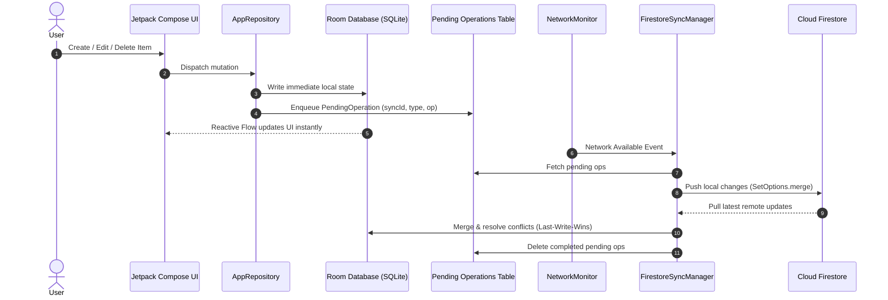

# 🌌 Aura Personal OS (Aura Notes)

<div align="center">

**A unified, high-performance personal operating system & productivity workspace for Android.**  
*Built with Kotlin, Jetpack Compose (Material 3), Room SQLite, and Firebase Cloud Sync.*

[](https://kotlinlang.org)
[](https://developer.android.com)
[](https://developer.android.com/jetpack/compose)
[](https://developer.android.com/training/data-storage/room)
[](https://firebase.google.com)

</div>

---

## 📖 Overview

**Aura Personal OS** is an all-in-one digital sanctuary designed to unify your daily workflow into a single fluid, reactive interface. It replaces fragmented single-purpose apps by integrating note-taking, cognitive energy task planning, daily journaling, habit tracking, multi-account finance management, group split-room settlements, sketchpad drawing, and time management into one cohesive system.

---

## ✨ Key Features & Modules

### 1. 📝 Zen Notebook ([`NotesComponents.kt`](app/src/main/java/com/example/ui/NotesComponents.kt))
- **Rich Document Model**: Categories, tag filtering, full-text search, pinning, bookmarking, and word/character analytics.
- **Snapshot Version History**: Every modification creates an immutable snapshot in `note_versions`, enabling one-tap rollbacks to previous revisions.
- **Multi-Modal Attachments**: Attach low-latency voice recordings, vector sketchpad drawings, and high-resolution photos directly to notes.
- **Dynamic Layout Switcher**: Seamless toggle between staggered grid and linear list views.

### 2. 🎯 Tasks & Objectives Planner ([`TasksComponents.kt`](app/src/main/java/com/example/ui/TasksComponents.kt))
- **Cognitive Energy Kanban**: Categorize goals by priority (*Urgent*, *High*, *Medium*, *Low*) and cognitive energy requirements (*High Energy*, *Medium Energy*, *Low Energy*).
- **Intelligent Recurrence**: Auto-schedules *Daily*, *Weekly*, and *Monthly* repeating tasks upon completion.
- **Focus Sprint Timer**: Integrated countdown Pomodoro timer for deep work sessions with spring-animated feedback.

### 3. 📖 Unified Day Section & Timeline ([`JournalCalendarComponents.kt`](app/src/main/java/com/example/ui/JournalCalendarComponents.kt))
- **Real-Time Daily Pipeline**: Automatically weaves all notes authored, tasks completed, and financial transactions logged today into a chronological activity stream.
- **Mood Analytics**: Daily mood logging across 7 visual mood themes (*Happy, Calm, Content, Neutral, Creative, Tired, Sad*).
- **Memory Lane ("On This Day")**: Automatically surfaces entries and reflections recorded on the exact date in previous years.

### 4. ⚡ Habit Tracking & Streak Engine ([`AppViewModel.kt`](app/src/main/java/com/example/ui/AppViewModel.kt))
- **High-Performance Streak Algorithm**: Dynamically calculates consecutive-day current streaks and all-time personal records.
- **30-Day Rolling Compliance**: Visual fulfillment percentage rings measuring habit consistency over rolling 30-day windows.
- **Dedicated Habit Timers & Reminders**: Configurable duration targets and notification schedules.

### 5. 💳 Money & Fintech Engine ([`MoneyComponents.kt`](app/src/main/java/com/example/ui/MoneyComponents.kt))
- **Multi-Account Ledgers**: Bank accounts, Cash Wallets, UPI, and Savings with automated balance reconciliation upon transaction creation, editing, or deletion.
- **Group Expense Rooms & Debt Minimization**: Real-time group expense splitting with a built-in **Transaction Minimization Graph Algorithm** that cancels out cyclical debts among participants.
- **Debt & Split Settlement**: Track who owes you and whom you owe, with one-tap balance adjustments.
- **Investment Portfolio & Savings Goals**: Track stocks, mutual funds, gold, crypto, and real estate alongside goal deadlines and recurring bill reminders.
- **Visual Analytics**: Interactive spend-this-period circular progress rings and 2×2 numbered metric cards.

### 6. 🎨 Sketchpad Canvas & Live Clock ([`DrawingCanvas.kt`](app/src/main/java/com/example/ui/DrawingCanvas.kt), [`ClockWidget.kt`](app/src/main/java/com/example/ui/ClockWidget.kt))
- **Custom Coordinate Serializer**: Fast string-serialized vector drawing paths for lightweight persistence in SQLite and Firestore.
- **Multi-stroke Tools**: Color palette, stroke thickness slider, eraser, and toggleable grid canvas.
- **Live Clock Widget**: Real-time analog radial and digital matrix clocks.

### 7. 🔒 Security & Privacy ([`AppViewModel.kt`](app/src/main/java/com/example/ui/AppViewModel.kt))
- **SHA-256 App Lock**: Glassmorphic PIN lock keypad gate with salted SHA-256 hash validation.
- **Zero Third-Party Ads / Trackers**: Completely private, self-contained architecture with zero telemetry or monetization banners.

---

## 🎨 Design System & Theming Engine

Aura Personal OS features a custom theming architecture supporting **5 distinct color palettes** across **3 display modes** (15 total theme variations):

| Palettes | Primary Accent | Secondary Accent | Tertiary Highlight |
|---|---|---|---|
| **Cyan Glow** *(Default)* | `#00E5FF` Digital Cyan | `#7C4DFF` Tech Purple | `#FFA726` Copper Warm |
| **Emerald Garden** | `#2ECD71` Mint Emerald | `#00B0FF` Ocean Indigo | `#FFC300` Golden Plum |
| **Radiant Sunset** | `#FF5722` Radiant Orange | `#E91E63` Warm Crimson | `#FFC107` Sunset Gold |
| **Royal Amethyst** | `#BB86FC` Orchid Purple | `#7C4DFF` Deep Purple | `#03DAC6` Cool Cyan |
| **Ocean Breeze** | `#0288D1` Sky Blue | `#00E676` Deep Green | `#FFD54F` Sand Yellow |

**Display Modes:**
- 🌙 **Dark Mode**: Deep obsidian `#0C0E12` base with layered slate cards.
- 🖤 **AMOLED Mode**: Pure `#000000` pitch black for maximum OLED power efficiency.
- ☀️ **Light Mode**: High-contrast `#FAFBFD` bone-white surface with crisp typography.

### Shared UI Component Library (`com.example.ui.components`)
- **`AuraNumberedStat`**: Tracked eyebrow badge (`01 · SPENT`) with large bold numbers and subtitles.
- **`AuraPrimaryAction` & `AuraSecondaryAction`**: Paired filled pill and dashed-outline action buttons with spring physics.
- **`AuraProgressRing`**: Animated circular progress gauge for spend/budget/streak tracking.
- **`AuraPeriodSelector`**: Horizontally scrollable pill selector with smooth sliding indicators.
- **`AuraHubCard`**: 2-column toolbox hub cards with icon-in-circle and one-line stat previews.
- **`AuraEmptyState` & `AuraLoadingState`**: Soft-tinted icon-in-circle empty views and shimmering skeleton placeholders.

---

## 🔄 Offline-First Synchronization



1. **Local-First Writes**: Instant UI response without waiting for network responses.
2. **Crash-Resilient Fallback**: Automatic programmatic Firebase initialization fallback if `google-services.json` is not provided.
3. **Multi-Device Conflict Resolution**: Timestamp-based Last-Write-Wins merging with soft-delete reconciliation.

---

## 🏗️ Project Structure

```text
aura-personal-os/
├── app/
│   ├── src/
│   │   ├── main/
│   │   │   ├── java/com/example/
│   │   │   │   ├── AuraApplication.kt         # Application lifecycle & Firebase fallback init
│   │   │   │   ├── MainActivity.kt            # Entry activity, edge-to-edge & theme root
│   │   │   │   ├── audio/
│   │   │   │   │   └── AudioController.kt     # Low-latency voice recording & playback
│   │   │   │   ├── auth/
│   │   │   │   │   └── AuthManager.kt         # Google Sign-In & Firebase Auth manager
│   │   │   │   ├── data/
│   │   │   │   │   ├── Database.kt            # Room entities (16 tables) and DAOs
│   │   │   │   │   ├── Repository.kt          # AppRepository singleton & statistics logic
│   │   │   │   │   ├── PendingOperation.kt    # Offline sync queue schema
│   │   │   │   │   ├── NetworkMonitor.kt      # ConnectivityManager state flows
│   │   │   │   │   ├── AuraErrorHandler.kt    # Global uncaught exception handler
│   │   │   │   │   └── AuraImageLoader.kt     # Coil image cache configuration
│   │   │   │   ├── sync/
│   │   │   │   │   ├── FirestoreSyncManager.kt# Two-way cloud sync & conflict resolution
│   │   │   │   │   └── SyncWorker.kt          # WorkManager background sync worker
│   │   │   │   └── ui/
│   │   │   │       ├── AppViewModel.kt        # Centralized reactive StateFlows
│   │   │   │       ├── MainAppContainer.kt    # Main scaffold, bottom navigation & hub
│   │   │   │       ├── NotesComponents.kt     # Notebook, editor, versioning
│   │   │   │       ├── TasksComponents.kt     # Energy Kanban board & focus timers
│   │   │   │       ├── JournalCalendarComponents.kt # Day pipeline & mood journal
│   │   │   │       ├── MoneyComponents.kt     # Multi-account finance & Splitwise rooms
│   │   │   │       ├── OnboardingScreen.kt    # Step-progress onboarding flow
│   │   │   │       ├── DrawingCanvas.kt       # Vector sketchpad canvas
│   │   │   │       ├── ClockWidget.kt         # Radial & matrix live clock widget
│   │   │   │       ├── AuraHaptics.kt         # Tactile haptic feedback triggers
│   │   │   │       ├── anim/                  # Spring press, shimmer, transitions, tokens
│   │   │   │       ├── components/            # Reusable design system component library
│   │   │   │       └── theme/                 # Palettes, ColorScheme, Typography (Type.kt)
│   │   │   ├── res/                           # Drawables, mipmaps, values
│   │   │   └── AndroidManifest.xml
│   │   └── test/                              # Unit & Roborazzi screenshot tests
│   └── build.gradle.kts
├── gradle/
│   └── libs.versions.toml                     # Gradle version catalog
├── AURA_UI_REDESIGN_PLAN_1.md                 # UI Redesign master execution plan
└── README.md
```

---

## 🚀 Getting Started

### Prerequisites
- [Android Studio Ladybug (2024.2+)](https://developer.android.com/studio) or newer
- JDK 17 or JDK 21
- Android device or emulator running API 24+ (Android 7.0+)

### Setup Instructions
1. **Clone the Repository**:
   ```bash
   git clone https://github.com/abitx42/aura-personal-os.git
   cd aura-personal-os
   ```

2. **Configure Environment / Keys**:
   - Copy `.env.example` to `.env` (optional for local mock mode).
   - If connecting a custom Firebase project, place your `google-services.json` inside the `app/` folder. *Note: Aura will seamlessly run in offline sandbox mode even without a Firebase configuration!*

3. **Build & Run**:
   - Open the project in Android Studio.
   - Let Gradle sync dependencies.
   - Select your target device or emulator and press **Run (Shift+F10)**.

---

## 📄 License

This project is licensed under the MIT License — see the repository for details.
